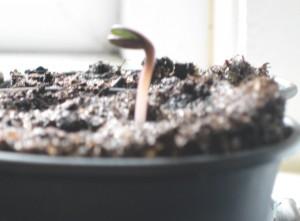

Last year, I attempted to grow sunflowers for the first time. Blue Peter always encouraged me to grow them as a child but I never did. So, last Spring, I bought some seeds and planted them in little pots. They all germinated nicely so, just before we went on holiday in May/June, I planted them out in the garden. Unfortunately, in under three days, the slugs had eaten them all. I was devasted for about a day then started plotting how to beat the slugs next year.

So, this Spring, I&#8217;ve started collecting toilet roll tubes (also in the spirit of Blue Peter) so that I can stick them in the ground around my small sunflower seedlings when I first plant them out. Hopefully, that&#8217;ll fool those pesky slugs.

In the meantime, I&#8217;ve bought a couple of packets of seeds (hoping that if one is so tasty that the toilet roll tubes fail to foil the crafty slugs, I can try again). I&#8217;ve planted the first packet into small pots on the windowsill and the first few seeds have germinated nicely:

That&#8217;s despite me mixing in too much of the water-saving crystals with the compost so that every time I water them, the soil expands so much that it starts to climb out of the pots!

I&#8217;m hoping these ones work because I want to see what they come out like. They&#8217;re not your usual yellow sunflowers. They&#8217;re a species called &#8216;Moulin Rouge&#8217; and the heads are a dark red instead of yellow. If they work, I&#8217;ll post a photo here. 🙂