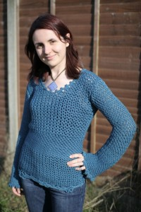

About this time last year, I finally got round to buying some yarn and a pattern to try re-learning to crochet. Last time I crocheted, I was about 12 and my efforts were limited to creating hair bun nets (as in the kind of things little girls wear &#8211; and indeed I wore &#8211; to ballet lessons). I think the last one was bright red for wearing to school on No Uniform Day for Red Nose Day. After that, I got bored of it and lost interest.

So after completing a smaller practice project last Spring, I decided to tackle something I&#8217;d actually wear. And as it was July, I figured it would be timely to make a jumper for the Winter (or even the Autumn, in my more optimistic moments). So I chose the Unseamly Sweater from a book I have called <a title="Stitch 'n' Bitch book website" href="http://www.knithappens.com/content/view/15/31/" target="_blank">Stitch &#8216;n&#8217; Bitch: The Happy Hooker</a>. This weekend (8 months later, and on the verge of Spring),  I finished it.

Here&#8217;s a photo of me modelling it, catalogue-style:

I&#8217;m really pleased with how it came out. There was a moment last weekend when it seemed I wouldn&#8217;t be able to complete the second sleeve because I&#8217;d run out of yarn, and my original supplier was permanently out of stock. The combined wonders of Google and Ebay saved the day.

So, being a good little IBMer, I now turn to Lessons Learned:

  * **Hold the crochet hook; don&#8217;t grip it.** I struggled for the first two-thirds of the body (crocheted as a tube &#8211; front and back at the same time) to get my &#8216;guage&#8217; right. Guage is the number of stitches to the inch, and is determined by a combination of weight of yarn, size of hook, and how tightly you hold the hook and yarn.
  * **Use the right size of hook.** Related to the point above, I started the jumper about 5 times before it was neither fit for a child nor fit for two of me at once. I actually used the right-sized hook for the arms (a size bigger than the pattern suggests) but, for the body, I used a size smaller and I ended up having to increase the wrong number of stitches to make it the right size of jumper. This also meant that I ended up buying more yarn than I should&#8217;ve needed.
  * **Buy enough yarn first time.** Every book tells you that this is the only way to ensure a consistent shade throughout &#8211; something only guaranteed by all the balls of yarn being dyed in the same batch. Because of the previous two points, I ran out of yarn not once but twice. Consequently, the body and the first quarter of one of the arms is a teeny bit darker shade than the rest of the arms.
  * **I enjoy the decorative bit more than the&#8230;um&#8230;mundane bit.** This is the same as for <a title="Sunflower pots blog post." href="http://www.lauracowen.co.uk/blog/2008/02/11/four-months-in-the-making-ormy-pottery-project/" target="_self">the sunflower pots I made two years ago</a>. Being crochet, it was actually quite quick to get through the mundane bits and I enjoyed it more than I expected. I do, however, much prefer making the fun frilly bits and changing stitches. So while I really like the finished effect of this particular pattern, it did get rather repetitive along the way.

Incidentally, the yarn I used (for both this jumper and my previous project) is Anchor Bamboolo, which is actually made from bamboo mixed with some cotton making a lovely soft, light, shiny yarn &#8211; similar I think to mercerized cotton, which is what I&#8217;d looked for originally. Bamboo is probably better for the environment than cotton, which is usually really bad for the environment because of the phenomenal amounts of pesticides that have to be used to grow it (though <a title="Ecological pros and cons of bamboo furniture." href="http://www.inhabitat.com/2007/02/17/ask-inhabitat-is-imported-bamboo-really-sustainable/" target="_blank">this article and its comments ponder the pros and cons of bamboo as a material</a> from a furniture design perspective).

So, bearing those lessons in mind, I&#8217;m now keen to find my next crochet project. I seem to have acquired a few patterns already and they might make more sense now that I&#8217;ve done a relatively easy one!