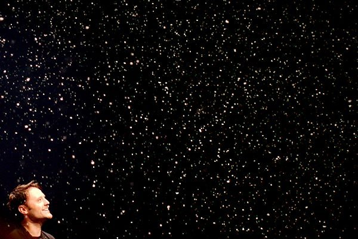

Behind-the-scenes documentaries, like <a title="Doctor Who Confidential on Wikipedia" href="http://en.wikipedia.org/wiki/Doctor_Who_Confidential" target="_blank">Doctor Who Confidential</a>, matter. They matter because they show viewers, in particular children still deciding what to do with their lives, that it takes more to produce a high-class TV programme than just a few actors who become famous. It shows what other creative and/or technical jobs there are in television.

A couple of weekends ago, we went to the <a title="Doctor Who Official Convention website" href="http://dwconvention.com/" target="_blank">Doctor Who Official Convention</a> (<a title="#dwcuk Twitter search" href="https://twitter.com/#!/search/%23dwcuk" target="_blank">#dwcuk</a>) in Cardiff. While one of the three main panels featured the three stars, Matt Smith, Karen Gillan and Arthur Darvill (along with executive producers Stephen Moffat and Caroline Skinner), most of the other scheduled events were focused on how Doctor Who is made.

At the very start of the day, we went to see Danny Hargreaves <del>blow things up</del> talk about the Special Effects on Doctor Who. In his Q&A session (after making it snow indoors), the first question asked was &#8220;How did you get into special effects work?&#8221; and, between questions like how he blew up the Torchwood Hub and how he makes the Doctor&#8217;s hands and head fiery during a regeneration, a later question was &#8220;When did you realise you wanted to work in special effects?&#8221;. Attendees were interested not just in the fictional stories and characters but in how the programme is made and the interesting careers they might not otherwise have come across.

Throughout the day, I heard audience members ask how to become costume and prosthetics designers and how to become script writers. Danny described how his team designs and creates the effects, assess the risks of blowing things up, and who they work with to make it all happen. He also explained how he came to be a trainee in the nascent world of special effects before studying Mechanical Engineering so that he could build the devices they need for Doctor Who (and the other shows he&#8217;s worked on, like Coronation Street). Directors of photography, set designers, executive producers, writers, and directors went on to talk about what their own jobs entailed day-to-day and how it all comes together to make an episode of Doctor Who.

These discussions continued the story that used to be told after each new episode of Doctor Who by Doctor Who Confidential on BBC3. Doctor Who Confidential started in 2005 with the return of Doctor Who. As well as talking about some interesting perspective on making that night&#8217;s episode of Doctor Who, it featured interviews with, and &#8216;day-in-the-life&#8217; documentaries about, the actors (including showing the less glamorous side of shivering in tents and quilted coats between takes), the casting directors, the producers, the writers, the choreographers, the costume designers, the special effects supervisors, the monster designers, the prosthetics experts, the directors, the assistant directors, and many, many others. It also held competitions for children to write a mini episode and then see the process of making it, which would&#8217;ve been an amazing experience!

Yes, it took a slightly odd turn in the last series when it turned a bit Top Gear by showing Karen Gillan having a driving lesson and Arthur Darvill swimming with sharks; possibly a misguided attempt to increase its popularity before it got canned anyway to cut costs.

I think it&#8217;s a real shame to lose Doctor Who Confidential and its insights into the skill, hard work, and opportunities in TV and film production.

* * *

Cool photo of Danny in the snow by [Tony Whitmore](tonywhitmoreweddings.com).