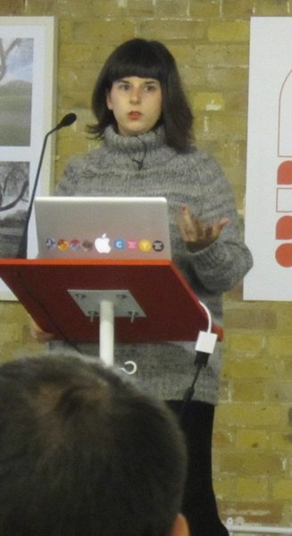
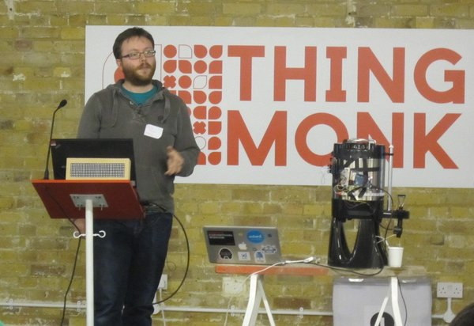
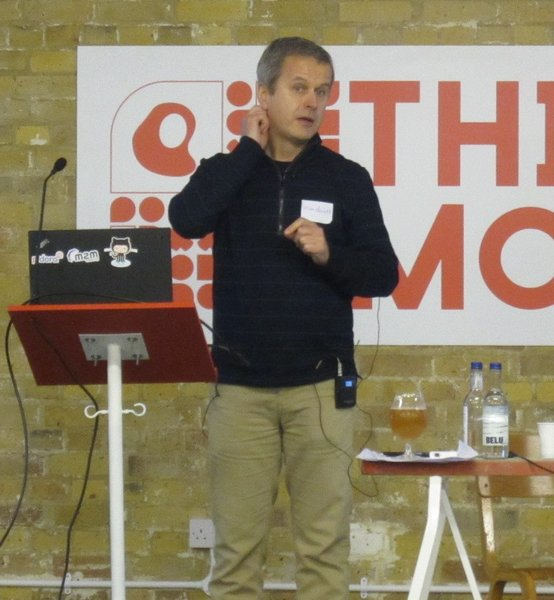
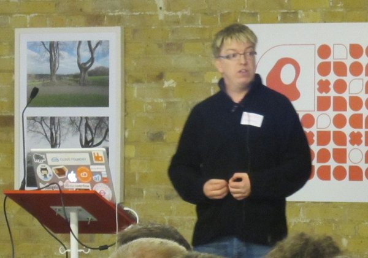
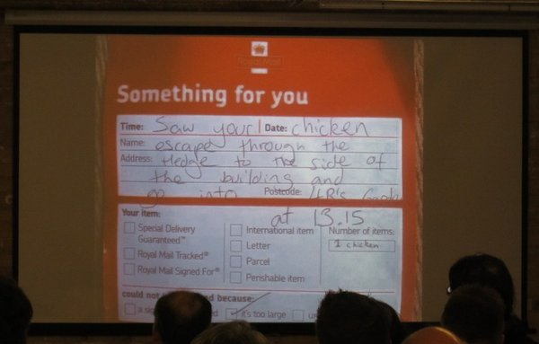
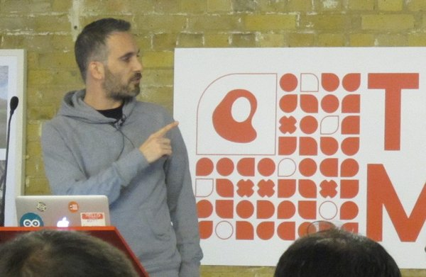
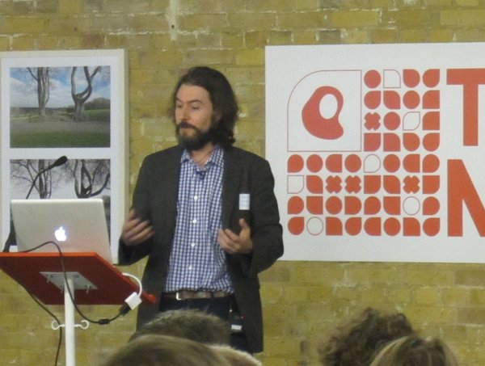
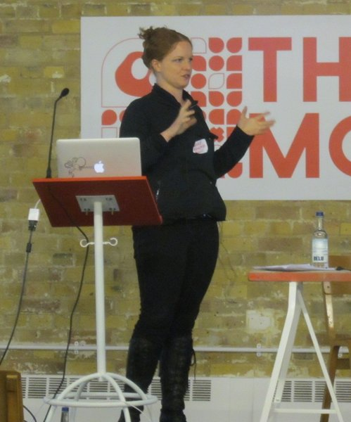

I attended <a href="http://redmonk.com/thingmonk/">ThingMonk 2013</a> conference partly because <a href="http://www-01.ibm.com/software/info/internet-of-things/">IBM&#8217;s doing a load of work around the Internet of Things</a> (IoT). I figured it would be useful to find out what&#8217;s happening in the world of IoT at the moment. Also, I knew that, as a *Monk production, the food would be amazing.

## What is the Internet of Things?

If you&#8217;re reading this, you&#8217;re familiar with using devices to access information, communicate, buy things, and so on over the Internet. The Internet of Things, at a superficial level, is just taking the humans out of the process. So, for example, if your washing machine were connected to the Internet, it could automatically book a service engineer if it detects a fault.

I say &#8216;at a superficial level&#8217; because there are obviously still issues relevant to humans in an automated process. It matters that the automatically-scheduled appointment is convenient for the householder. And it matters that the householder trusts that the machine really is faulty when it says it is and that it&#8217;s not the manufacturer just calling out a service engineer to make money.

This is how [James Governor](https://twitter.com/monkchips) of [RedMonk](http://redmonk.com/), who conceived and hosted ThingMonk 2013, explains IoT:

## What is ThingMonk 2013?

ThingMonk 2013 was a fun two-day conference in London. On Monday was a hackday with spontaneous lightning talks and on Tuesday were the scheduled talks and the evening party. I wasn&#8217;t able to attend Monday&#8217;s hackday so you&#8217;ll have to read someone else&#8217;s write-up about that (you could try [Josie Messa&#8217;s](http://josiemessa.wordpress.com/2013/12/09/thingmonk-day-1/), for instance).

## The talks

I bought my Arduino getting started kit (which I used for [my Christmas lights energy project](http://www.lauracowen.co.uk/blog/2010/02/09/electricity-monitoring-with-christmas-lights-and-arduino/ "Electricity monitoring with Christmas lights and Arduino") in 2010) from Tinker London so I was pleased to finally meet Tinker&#8217;s former-CEO, <a style="line-height: 1.5em;" href="https://twitter.com/iotwatch">Alexandra Dechamps-Sonsino</a>, at ThingMonk 2013. I&#8217;ve known her on Twitter for about 4 years but we&#8217;d never met in person. Alex is also founder of the <a href="https://twitter.com/GNLteam">Good Night Lamp</a>, which <a title="The Ambient Kettle" href="http://www.lauracowen.co.uk/blog/2013/03/16/the-ambient-kettle/">I blogged about earlier this year</a>. She talked at ThingMonk about &#8220;the past, present and future of the Internet of Things&#8221; from her position of being part of it.

I think it was probably <a style="line-height: 1.5em;" href="https://twitter.com/knolleary">Nick O&#8217;Leary</a> who first introduced me to the Arduino, many moons ago over cups of tea at work. He spoke at ThingMonk about <a style="line-height: 1.5em;" href="http://knolleary.net/2013/12/05/wiring-the-internet-of-things-thingmonk-talk/">wiring the Internet of Things</a>. This included a demo of his latest project, <a style="line-height: 1.5em;" href="http://nodered.org/">NodeRED</a>, which he and IBM have recently <a style="line-height: 1.5em;" href="https://github.com/node-red/node-red">open sourced on GitHub</a>.

Sadly I missed the previous day when it seems Nick and colleagues, [Dave C-J](https://twitter.com/ceejay) and [Andy S-C](https://twitter.com/andysc), won over many of the hackday attendees to the view that IBM&#8217;s [MQTT](http://mqtt.org/) and NodeRED are the coolest things known to developerkind right now. So many people mentioned one or both of them throughout the day. One developer told me he didn&#8217;t know why he&#8217;d not tried MQTT 4 years ago. He also seemed interested in playing with NodeRED, just as soon as the shock that IBM produces cool things for developers had worn off.

[Ian Skerrett](http://twitter.com/ianskerrett) from [Eclipse](http://www.eclipse.org/) talked about the role of Open Source in the Internet of Things. Eclipse has recently started the [Paho](http://www.eclipse.org/paho/) project, which focuses on open source implementations of the standards and protocols used in IoT. The project includes IBM&#8217;s [Really Small Message Broker](https://www.ibm.com/developerworks/community/groups/service/html/communityview?communityUuid=d5bedadd-e46f-4c97-af89-22d65ffee070) and Roger Light&#8217;s [Mosquitto](http://mosquitto.org/).

[Andy Piper](http://twitter.com/andypiper) talked about [the role of signals in the IoT](http://www.slideshare.net/andypiper/the-internet-of-things-is-made-of-signals).

There were a couple of talks about people&#8217;s experiences of startups producing physical objects compared with producing software. [Tom Taylor](http://twitter.com/tomtaylor) talked about setting up [Newspaper Club](http://www.newspaperclub.com/), which is a site where you can put together and get printed your own newspaper run. His presentation included this slide:

Matt Webb](http://twitter.com/genmon) talked about producing [Little Printer](http://bergcloud.com/littleprinter/), which is an internet-connected device that subscribes to various sources and prints them for you on a strip of paper like a shop receipt.

Patrick Bergel](http://twitter.com/goodmachine) made the very good point in his talk that a lot of IoT projects, at the moment, are aimed at &#8216;non-problems&#8217;. While fun and useful for learning what we can do with IoT technologies, they don&#8217;t really address the needs of real people (ie people who aren&#8217;t &#8220;hackers, hipsters, or weirdos&#8221;). For instance, there are increasing numbers of older people who could benefit from things that address problems social isolation, dementia, blindness, and physical and cognitive impairments. His point was underscored throughout the day by examples of fun-but-not-entirely-useful-as-is projects, such as flying a drone with fruit. That&#8217;s not to say such projects are a waste of time in themselves but that we should get moving on projects that address real problems too.

The talk which chimed the most with me, though, was [Claire Rowland](http://twitter.com/clurr)&#8216;s on the important user experience UX issues around IoT. She spoke about the importance of understanding how users (householders) make sense of automated things in their homes.

## The book

I bought a copy of [Adrian McEwan](https://twitter.com/amcewen)&#8216;s [Designing The Internet of Things](http://book.roomofthings.com/) book from Alex&#8217;s pop-up shop, [(Works)shop](https://twitter.com/Works_Shop). Adrian&#8217;s a regular at [OggCamp](http://oggcamp.org/) and kindly agreed to sign my copy of his book for me.

## The food

The food was, as expected, amazing. I&#8217;ve never had bacon and scrambled egg butties that melt in the mouth before. The steak and Guinness casserole for lunch was beyond words. The evening party was sustained with sushi and tasty curry.

Thanks, James!