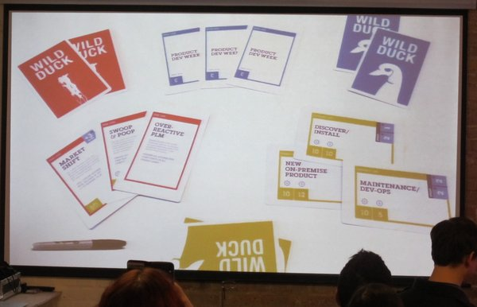

After [Monkigras](http://monkigras.com) 2013, I was really looking forward to Monkigras 2014. The great talks about developer culture and creating usable software, the amazing buzz and friendliness of the event, the wonderful lack of choice over which talks to go to (there&#8217;s just one track!!), and (of course) the catering:

## The talks at Monkigras 2014

The talks were pretty much all great so I&#8217;m just going to mention the talks that were particularly relevant to me.

[Rafe Colburn](http://twitter.com/rafeco "@rafeco") from [Etsy](http://www.etsy.com/) talked about how to motivate developers to fix bugs (IBMers, read &#8216;defects&#8217;) when there&#8217;s a big backlog of bugs to fix. They&#8217;d tried many strategies, including bug rotation, but none worked. The answer, they found, was to ask their support team to help prioritise the bugs based on the problems that users actually cared about. That way, the developers fixing the bugs weren&#8217;t overwhelmed by the sheer numbers to choose from. Also, when they&#8217;d done a fix, the developers could feel that they&#8217;d made a difference to the user experience of the software.

While I&#8217;m not responsible for motivating developers to fix bugs, my job does involve persuading developers to write articles or sample code for [WASdev.net](https://www.ibmdw.net/wasdev/). So I figure I could learn a few tricks.

A couple of talks that were directly applicable to me were [Steve Pousty](http://twitter.com/TheSteve0 "@TheSteve0")&#8216;s talk on how to be a developer evangelist and [Dawn Foster](http://twitter.com/geekygirldawn "@geekygirldawn")&#8216;s on taking lessons on community from science fiction. The latter was a quick look through various science fiction themes and novels applied to developer communities, which was a neat idea though I wished I&#8217;d read more of the novels she cited. I was particularly interested in Steve&#8217;s talk because I&#8217;d seen him speak last year about how his PhD in Ecology had helped him understand communities as ecosystems in which there are sometimes surprising dependencies. This year, he ran through a checklist of attributes to look for when hiring a developer evangelist. Although I&#8217;m not strictly a developer evangelist, there&#8217;s enough overlap with my role to make me pay attention and check myself against each one.

One of the risks of TED Talk-style talks is that if you don&#8217;t quite match up to the &#8216;right answers&#8217; espoused by the speakers, you could come away from the event feeling inadequate. The friendly atmosphere of Monkigras, and the fact that some speakers directly contradicted each other, meant that this was unlikely to happen.

It was still refreshing, however, to listen to [Theo Schlossnagle](http://twitter.com/postwait "@postwait") basically telling people to do what they find works in their context. Companies are different and different things work for different companies. Similarly, developers are people and people learn in different ways so developers learn in different ways. He focused on how to tell stories about your own failures to help people learn and to save them from having to make the same mistakes.

Again, this was refreshing to hear because speakers often tell you how you should do something and how it worked for them. They skim over the things that went wrong and end up convincing you that if only you immediately start doing things their way, you&#8217;ll have instant success. Or that inadequacy just kicks in like when you read certain people&#8217;s Facebook statuses. Theo&#8217;s point was that it&#8217;s far more useful from a learning perspective to hear about the things that went wrong for them. Not in a morbid, defeatist way (that way lies only self-pity and fear) but as a story in which things go wrong but are righted by the end. I liked that.

[Ana Nelson](http://twitter.com/ananelson "@") (geek conference buddy and friend) also talked about storytelling. Her point was more about telling the right story well so that people believe it rather than believing lies, which are often much more intuitive and fun to believe. She impressively wove together an argument built on various fields of research including Psychology, Philosophy, and Statistics. In a nutshell, the kind of simplistic headlines newspapers often publish are much more intuitive and attractive because they fit in with our existing beliefs more easily than the usually more complicated story behind the headlines.

The Gentle Author spoke just before lunch about his daily blog in which he documents stories from local people. I was lucky enough to win one of his signed books, which is beautiful and engrossing. Here it is with my swagbag:

<blockquote class="twitter-tweet" data-width="550" data-dnt="true">
  

    My swag bag from <a href="https://twitter.com/hashtag/monkigras?src=hash&ref_src=twsrc%5Etfw">#monkigras</a> &#8211; I was a lucky recipient of a beautiful, signed London Album by <a href="https://twitter.com/thegentleauthor?ref_src=twsrc%5Etfw">@thegentleauthor</a> <a href="http://t.co/6BaqBdtXP5">pic.twitter.com/6BaqBdtXP5</a>
  

  
  

    &mdash; Laura Cowen (@lauracowen) <a href="https://twitter.com/lauracowen/status/429660347230728194?ref_src=twsrc%5Etfw">February 1, 2014</a>
  

</blockquote>

After his popular talk last year, [Phil Gilbert](http://twitter.com/philgilbertsr "@philgilbertsr") of IBM returned to give an update on how things are going with Design@IBM. Theo&#8217;s point about context of a company being important is so relevant when trying to change the culture of such a large company. He introduced a new card game that you can use to help teach people what it&#8217;s like to be a designer working within the constraints of a real software project. I heard a fair amount of interest from non-IBMers who were keen for a copy of the cards to be made available outside IBM.

On the UX theme, I loved [Leisa Reichelt](http://twitter.com/leisa "@leisa")&#8216;s talk about introducing user research to the development teams at GDS. While all areas of UX can struggle to get taken seriously, user research (eg interviewing participants and usability testing) is often overlooked because it doesn&#8217;t produce visual designs or code. Leisa&#8217;s talk was wonderfully practical in how she related her experiences at GDS of proving the worth of user research to the extent that the number of user researchers has greatly increased.

And lastly I must mention [Project Andiamo](http://projectandiamo.com/), which was born at Monkigras 2013 after watching a talk about [laser scanning and 3D printing old railway trains](http://www.lauracowen.co.uk/blog/2013/02/10/monkigras-2013-scaling-craft/ "Monkigras 2013: Scaling craft"). The project aims to produce medical orthotics, like splints and braces, by laser scanning the patient&#8217;s body and then 3D printing the part. This not only makes the whole process much quicker and more comfortable, it is at a fraction of the cost of the way that orthotics are currently made.

If you can help in any way, take a look at their website and get in touch with them. Samiya and Naveed&#8217;s talk was an amazing example of how a well-constructed story can get a powerful message across to its listeners:

<blockquote class="twitter-tweet" data-width="550" data-dnt="true">
  

    "This is supposed to be a compliment, but your talk made me cry" &#8211; <a href="https://twitter.com/monkigras?ref_src=twsrc%5Etfw">@monkigras</a>
  

  
  

    &mdash; spooky james (@varjmes) <a href="https://twitter.com/varjmes/status/429299992462131200?ref_src=twsrc%5Etfw">January 31, 2014</a>
  

</blockquote>

After Monkigras 2014, I&#8217;m now really looking forward to Monkigras 2015.

* * *

<blockquote class="twitter-tweet" data-width="550" data-dnt="true">
  

    My 11yr old just said that <a href="https://twitter.com/hashtag/monkigras?src=hash&ref_src=twsrc%5Etfw">#monkigras</a> could be translated as "fat monkey" &#8230; not sure what to make of that <a href="https://twitter.com/monkchips?ref_src=twsrc%5Etfw">@monkchips</a>
  

  
  

    &mdash; Paul Johnston (@PaulDJohnston) <a href="https://twitter.com/PaulDJohnston/status/433720679100579841?ref_src=twsrc%5Etfw">February 12, 2014</a>
  

</blockquote>

&nbsp;