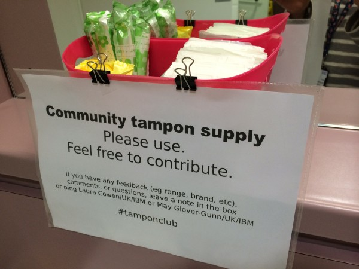

If you follow me on Twitter or Facebook, you might have seen me use the hashtag [#TamponClub](https://twitter.com/hashtag/tamponclub "#TamponClub Twitter search")*. It began sometime after a few of us &#8216;Women In Tech&#8217; went to a tech evening event at the awesome new HQ of Twitter UK.

As well as the funky food, the tech talks, and (obvs) the [dalek in the foyer](https://twitter.com/lauracowen/status/494963166254993408 "Me and the Twitter Dalek"), we were impressed by the presence of free sanitary products in the women&#8217;s toilets.

## Free tampons?!?

Free tampons wasn&#8217;t something I&#8217;d ever thought about before. Sure, I agree that putting tax on tampons (my shorthand for all sanitary products because, well, it reads funnier) is ridiculous but the idea of [justifying giving them away for free](http://www.theguardian.com/commentisfree/2014/aug/11/free-tampons-cost-feminine-hygiene-products?CMP=twt_gu "The case for free tampons") just hadn&#8217;t crossed my mind.

Then the brilliant [Alice Bartlett](https://twitter.com/alicebartlett "@alicebartlett on Twitter") wrote about how seeing the tampons-in-the-toilet prompted her to do the same at her own workplace. She basically supplied free tampons and towels in the women&#8217;s toilets for both her own convenience and for anyone else who needed them.

It&#8217;s [a great post](http://alicebartlett.co.uk/blog/tampon-club "Alice's blog post on Tampon Club") &#8211; everyone should read it (tl;dr imagine if you had to supply your own toilet roll at work&#8230;and sometimes you forgot&#8230;).

Her post (really, [go read it now](http://alicebartlett.co.uk/blog/tampon-club "Alice's blog post on Tampon Club"), I&#8217;ll wait for you to get back) sparked a brief conversation on Twitter. Other women loved the idea and proposed starting community Tampon Clubs in their own workplaces.

[@maygg](https://twitter.com/maygg "@maygg on Twitter") and I decided to start a Tampon Club in the nearest toilets to our desks (DE3, for anyone au fait with the IBM Hursley site).

## Tampon Club at IBM Hursley

It took longer than it should&#8217;ve but, as of this Wednesday: ta-da!

If you use the DE3 women&#8217;s toilets, let us know what you think. Please use the supplies and feel free to contribute if you want to.

If you use other women&#8217;s toilets around Hursley and you want to do the same, let us know!

## Tampon Club response

As it&#8217;s only our first week, we have no idea how it&#8217;ll go. But we&#8217;ve had a few positive comments already, including (I hope they don&#8217;t mind me quoting them anonymously):

> &#8220;great idea in the ladies!&#8230;had a box in my drawer so I&#8217;ve added it to the collection&#8221;

> &#8220;thanks for the new additions to the ladies loos &#8211; really great idea &#8211; I don&#8217;t know how many times I have come in having been caught out and don&#8217;t want to carry a big box in full view from the canteen!!&#8221;

We&#8217;re keeping tabs on cost and stock so I&#8217;ll report back after a few weeks.

* * *

*The girl who tweeted a #TamponClub photo of herself with a bunch of tampons stuffed in her mouth is nothing to do with us. 🙂