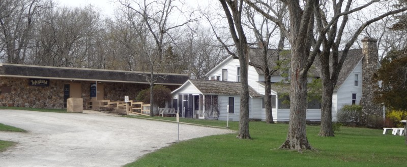
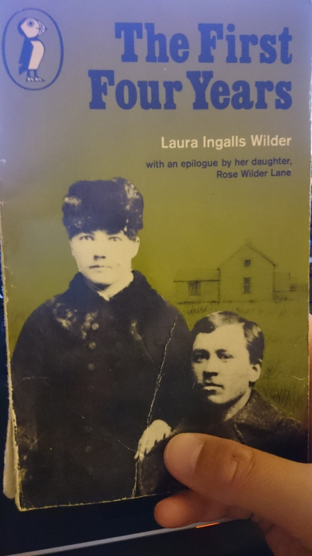
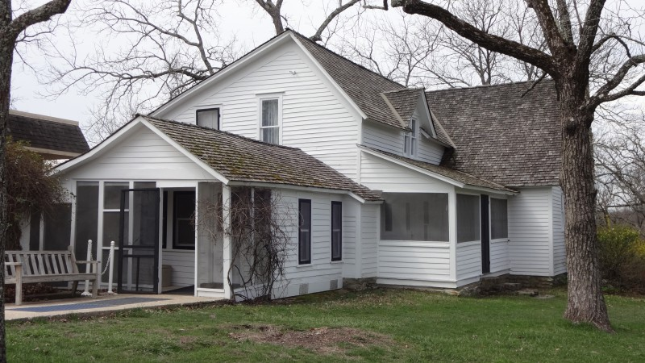
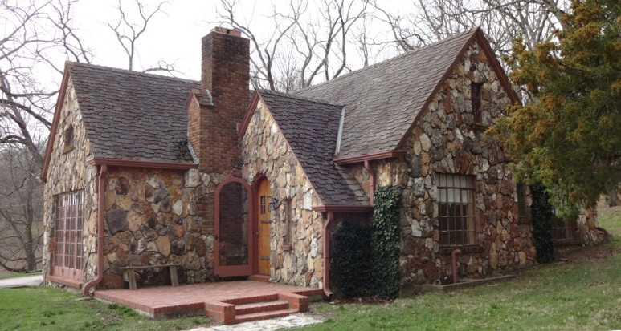
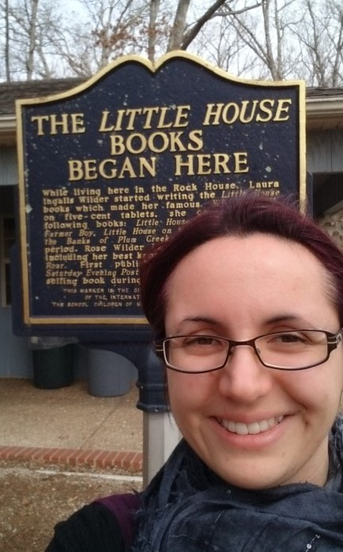
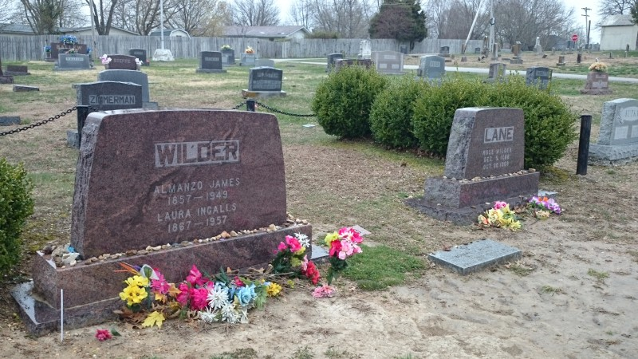
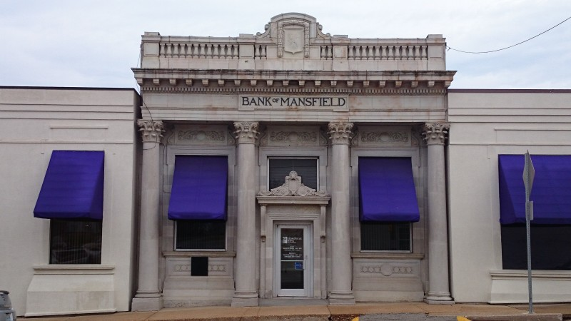
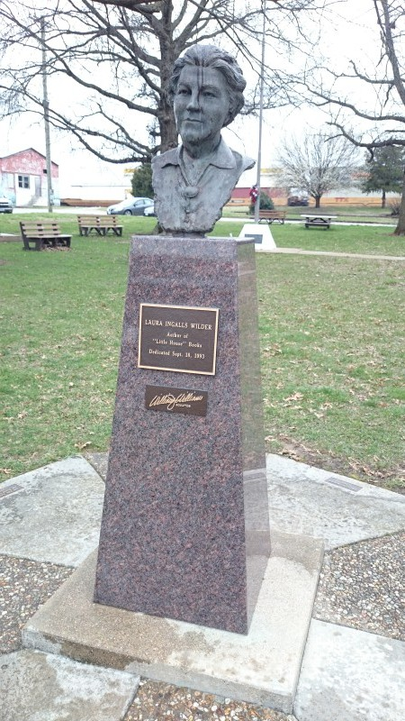

The real, actual reason for my trip to the US in March/April this year was to fulfil a childhood ambition (or tick something off my [bucket-list](http://www.urbandictionary.com/define.php?term=bucket+list&defid=2749410 " bucket list definition on the Urban Dictionary"), if you will) to visit the [Laura Ingalls Wilder House & Museum](http://www.lauraingallswilderhome.com/ "Laura Ingalls Wilder Home website"). That involved a trip to Mansfield, squarely situated in the &#8216;[fly-over state](http://www.urbandictionary.com/define.php?term=fly-over+state&defid=2367358 "fly-over state definition on the Urban Dictionary")&#8216; of Missouri.

Many people have responded to this explanation with &#8220;Who?&#8221;. So I ask if they remember [Little House on the Prairie on TV](https://en.wikipedia.org/wiki/Little_House_on_the_Prairie_(TV_series) "Little House on the Prairie TV Series on Wikipedia"). If you do, well, not that, but the books that the TV series was based on. Despite being a bit obsessed with the &#8216;[Laura books](http://www.amazon.co.uk/Laura-Ingalls-Wilder/e/B00LZF3FCY "Laura books on Amazon")&#8216; when I was a pre-teen, I saw the odd episode of the TV series but never got into it. It was the books all the way, for me.

## Laura Ingalls Wilder and Mansfield, Missouri

Laura Ingalls Wilder was born in 1867 in Wisconsin just after the American Civil War (1861-1865) ended. As a result of the US Government&#8217;s [Homestead Acts](https://en.wikipedia.org/wiki/Homestead_Acts "Homestead Acts on Wikipedia") around that time, her family became American pioneers, moving around the middle states to lay claim to free land and farm it. Her childhood took place in log cabins, covered wagon trains, and wild prairies. As a teenager, settled in North Dakota, she saw the immensely rapid growth of new towns around her family and other settlers.

In 1894, she and her husband and daughter travelled again, this time to the new town of Mansfield in Missouri. They bought some land and built a house and farm where she and her husband lived for the rest of their lives. She lived through the inventions of cars, flying, radio, cinema, and TV. She died in 1957; it&#8217;s quite amazing how different the world must have been by then.

In the 1920s, already an experienced writer, she started to write about her early life. With collaboration by her daughter, Rose (a successful journalist and, later, a war correspondent), she wrote the &#8216;[Little House](http://www.amazon.co.uk/Laura-Ingalls-Wilder/e/B00LZF3FCY "Laura books on Amazon")&#8216; (or &#8216;Laura&#8217;) books. Although fictional, they were based heavily on the real experiences of her life. The books were successful from the start and provided her with a comfortable income, as well as fans who would come to visit her at her home when she was old. When she died, the farm became (with Rose&#8217;s financial assistance) an early incarnation of the not-for-profit museum that&#8217;s still there today.

 

I learnt about the existence of the Laura Ingalls Wilder House & Museum in the Introduction of my copy of _The First Four Years_, the final book in the series. Obviously I wanted to go. It wasn&#8217;t until the dawn of Google Maps that it occurred to me to actually look up where Mansfield, Missouri (MO) was. I&#8217;m still not sure I really appreciated just where it was until I started trying to plan a trip there early this year.

## Getting there

As I was coming from the UK, it was quite a long and expensive trip to make just to go to a museum for a day. So I managed to build it out into a bigger trip, [My Big American Adventure](http://mybigamericanadventure.tumblr.com/ "My Big American Adventure on Tumblr"). The upshot was that I flew from Boston, MA, to St Louis on the Eastern border of MO (the main alternative would be Kansas City on the Western border of MO).

I picked St Louis mainly for its [Gateway Arch](https://en.wikipedia.org/wiki/Gateway_Arch "St Louis Gateway Arch"). I didn&#8217;t want to be travelling at weird times or hauling my luggage around with me, so I spent a couple of nights in St Louis at the awesome, if odd, [Missouri Athletic Club](http://www.mac-stl.org/ "Missouri Athletic Club"). As it turned out, when I was in St Louis planning my drive to Springfield (where I stayed two nights in a motel), I discovered that I would be travelling in the direction of the historic Route 66, which was [a nice serendipity that I wrote about separately](http://lauracowen.co.uk/blog/2015/04/30/finding-and-following-historic-route-66-through-missouri/).

## At the Laura Ingalls Wilder House

I rocked up at Rocky Ridge Farm at about 10.30am and was in time to join the 11am tour of the houses. For the $10 admission, I watched a brief introductory video, and saw the main Rocky Ridge Farmhouse, which Laura and her husband, Manly, built, and The Rock House, a bungalow that Rose built for Laura and Manly when they were older. The latter house is important because, although Laura lived there for less than a decade, it&#8217;s where she started writing the Little House books. Sadly, you can&#8217;t take any photos of the inside of the houses or museum (which is also included in the admission). There are postcards you can buy of the farmhouse&#8217;s interior (and I did) but none of The Rock House. Which is rather frustrating as it&#8217;s not like I can pop back any time to remind myself what it all looked like.

The inside of the farmhouse is really interesting. Because it was built, room-by-room, over 17 years as they could afford it, the styles changed so that the later rooms were more modernly styled. The kitchen (the first room) was pretty cool for its time, though, in that the units were all fitted. Laura designed it so that it would be easy to clean and so that it could cope with both family cooking and the messy chores of a farmer&#8217;s wife, like gutting and plucking birds. She later wrote about the design of the kitchen for a magazine. It even had a &#8216;hatch&#8217; so that dishes could be passed through to the dining-room table without having to keep walking back and forth between the rooms.

Manly, her husband, was very handy and had made a lot of the furniture himself, including a three-legged desk-lamp that wouldn&#8217;t now look out-of-place in Habitat. There were also cushion covers he&#8217;d &#8216;hooked&#8217; (like rugs) on the settee in the living-room.

The Rock House is round the other side of the land. Until recently, there was a footpath you could take to get there from the main farmhouse. That was out of action when I was there, though (maybe something to do with the on-going building works for the new museum building elsewhere on the land), so we had to drive ourselves round to another entrance to get to The Rock House.

The Rock House was built in the early 20th Century, by contractors, and paid for by Rose. I think it was meant to be a sort of retirement bungalow for her parents. It had all mod-cons like central heating, modern plumbing and electrics, and lots of light. It even had a fully fitted bathroom &#8211; which is still there in its original form! The evidence suggests that Laura wasn&#8217;t that happy about being shunted off into a new house by her daughter, despite its benefits. Rose had moved into the farmhouse but when she moved away again, Laura and Manly sold The Rock House and its land and moved back into their own farmhouse again.

Still, whilst living at The Rock House, Laura started writing the Little House books and I saw the actual desk she wrote at!

## Back at the museum

The museum is currently just a large, single room with display cases all around and the main desk where you buy your admission ticket. Some of the Wilders&#8217; belongings were displayed in the houses but a lot were kept here. That included things like Pa&#8217;s fiddle, Mary&#8217;s Braille slate, a collection of &#8216;name cards&#8217; (think [Moo cards](http://uk.moo.com/products/minicards.html "Moo minicards") of the 1880s), patchwork quilts, letters, books, magazine articles, manuscripts, household goods and crockery (including Laura and Manly&#8217;s English Wedgewood wedding crockery!) and a load of Rose&#8217;s possessions too.

Although the museum is very proud of having Pa&#8217;s fiddle, the glass dish that was rescued from a house fire, and many other things, I was somehow most moved by seeing the actual piece of lace that Laura&#8217;s friend Ida Brown made for her and presented to her as a wedding gift in _These Happy Golden Years_. It just seemed the most personal thing that had survived through more than a century.

Somewhere along my travels to Mansfield, I&#8217;d picked up a nasty cough and cold and spent much of the day in a slightly glazed, snotty, spluttering mess. That didn&#8217;t stop me spending about 3 hours in the museum itself looking at the exhibits and reading the articles and boards on display. I must&#8217;ve left so many germs in there&#8230;

## Other sights in Mansfield, Missouri

After that, I browsed the onsite bookshop for a while and bought some souvenirs. Eventually, I accepted there was nothing else I could see there, so I headed off up to the Mansfield Cemetery where Laura, Manly, and Rose are all buried.

In Mansfield is still the Bank of Mansfield, where Laura and Manly got the mortgage for the land at Rocky Ridge Farm. You can&#8217;t see at this resolution but over the door it says it was established in 1892, just two years before Laura and Manly moved there. That&#8217;s how new Mansfield was when they arrived.

I also stopped off in the centre of Mansfield itself to get some food. There, I saw the bust of Laura as an old woman:

## A note to 9-year-old Me

> Dear Laura (not that one),  
> It&#8217;ll take you about 25 years to get to Rocky Ridge Farm. I know that seems like an unimaginable amount of time but, I promise, you will get there. And it&#8217;ll be worth it. It&#8217;ll be as brilliant as you expect it to be.  
> x

