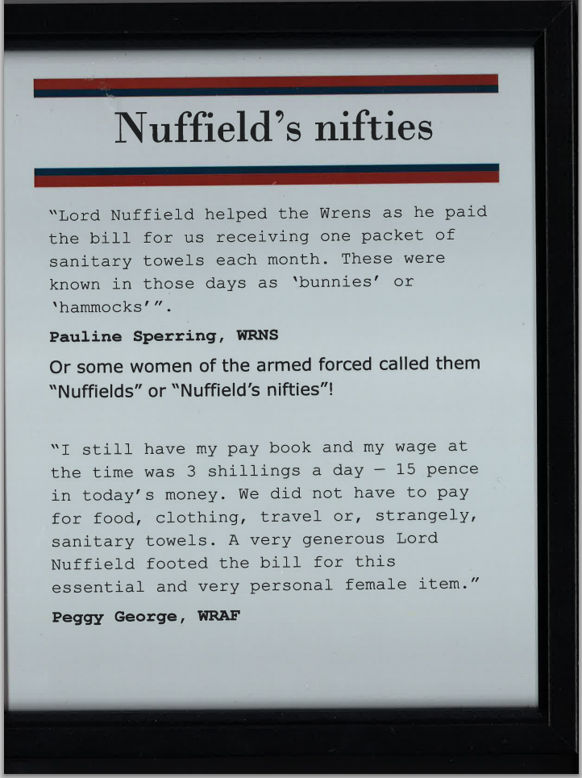

Eagle-eyed [AndySC](https://twitter.com/andysc/ "AndySC on Twitter") was out and about visiting [Nuffield Place](http://www.nationaltrust.org.uk/nuffield-place/ "Nuffield Place") and spotted this for [Tampon Club](http://www.tampon.club/ "Tampon Club website"):

> &#8220;an early example of someone taking @tampon_club needs into account!&#8221;  
> &#8212; AndySC 

[Lord Nuffield](https://en.wikipedia.org/wiki/William_Morris,_1st_Viscount_Nuffield "Lord Nuffield on Wikipedia") is the Nuffield of Nuffield Hospitals and the William Morris of Morris Minors. Nuffield Place is his old home, which is now preserved by the National Trust for people to visit and find out about the things he did, including his contributions to the war effort during World War II.